<!-- page_number: true -->
<!-- footer: Machine Learning : initiation -->

Machine Learning
===

##### Initiation au machine learning

###### par [Fabien Barbaud](fabien.barbaud@timeonegroup.com) - [@BarbaudFabien](https://twitter.com/BarbaudFabien)

---

# Définition

L'apprentissage automatique ou apprentissage statistique, champ d'étude de l'intelligence artificielle, concerne **la conception**, **l'analyse**, **le développement** et **l'implémentation de méthodes** permettant à une machine (au sens large) **d'évoluer** par un processus systématique, et ainsi de remplir **des tâches difficiles ou problématiques** par des moyens algorithmiques plus classiques.

[Wikipedia](https://fr.wikipedia.org/wiki/Apprentissage_automatique)

---

# Collecter les données

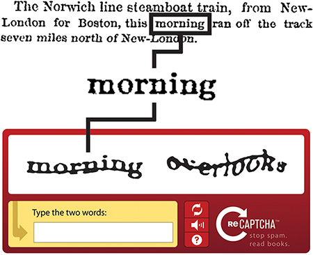

[The reCAPTCHA Project](https://www.cylab.cmu.edu/partners/success-stories/recaptcha.html)

---

# Modéliser les données

loyer mensuel (en €) | surface (en m2) 
---|---
1500|32
2120|65
2500|60
...|...

---

# Modéliser les données

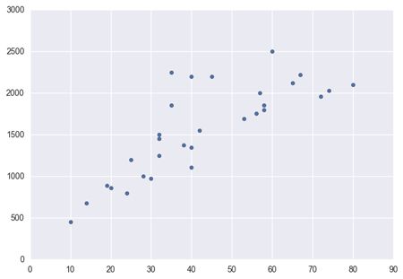

Loyer mensuel en fonction de la surface du logement

---

# Modéliser les données

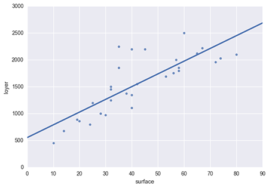

La droite de régression correspondant à la modélisation du nuage de points

---

# Modéliser les données

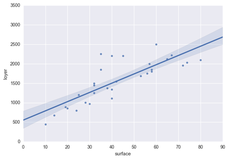

L'intervalle de confiance (à 90%)

---

# Les phases

---

# Apprentissage

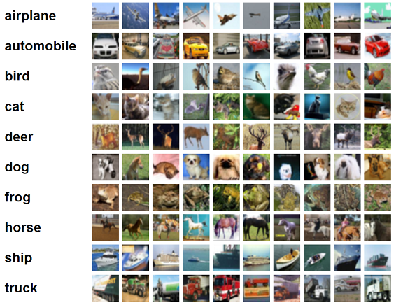

Jeu de données CIFAR-10

---

# Algorithmes d'apprentissage

## Régression linéaire

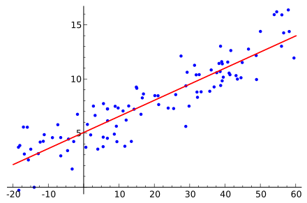

[Wikipedia](https://fr.wikipedia.org/wiki/R%C3%A9gression_lin%C3%A9aire)

---

# Algorithmes d'apprentissage

## k-NN (*k-Nearest Neighbors algorithm*)

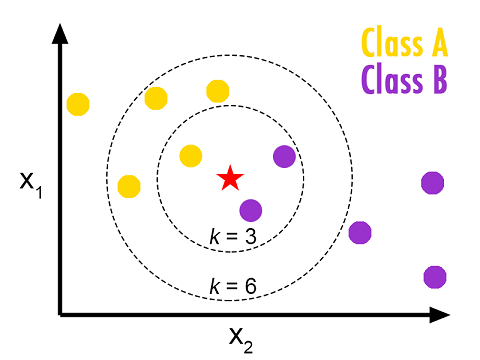

[Classification using k-Nearest Neighbors in R](http://en.proft.me/2017/01/22/classification-using-k-nearest-neighbors-r/)

---

# Algorithmes d'apprentissage

## Support Vector Machine

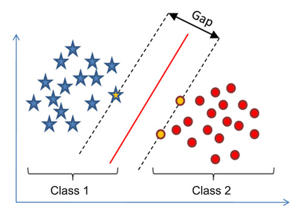

[Support Vector Machine without tears](http://diggdata.in/post/94066544971/support-vector-machine-without-tears)

---

# Algorithmes d'apprentissage

## Réseaux de neurones

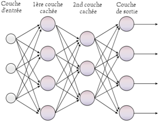

[Une première introduction au Deep Learning](https://blogs.msdn.microsoft.com/mlfrance/2016/04/28/une-premiere-introduction-au-deep-learning/)

---

# Algorithmes d'apprentissage

## Random Forest

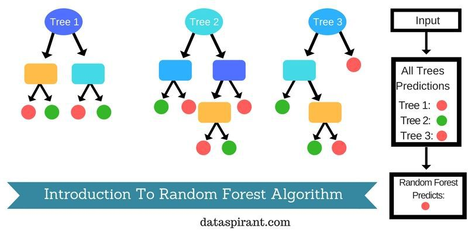

[Dataaspirant](http://dataaspirant.com/2017/05/22/random-forest-algorithm-machine-learing/)

---

# Apprentissage supervisé et non-supervisé

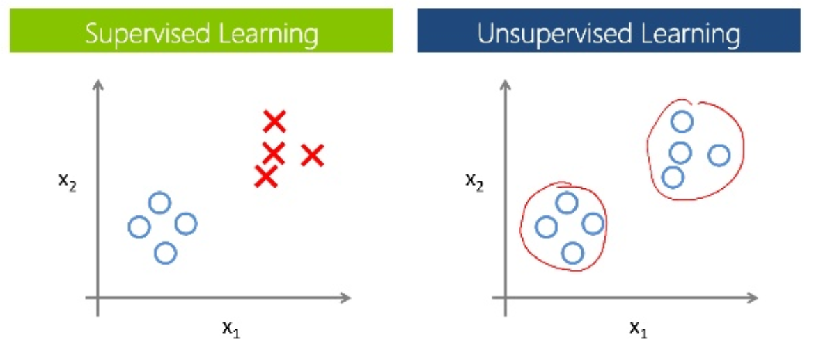

[Intro au Big Data & Machine Learning](https://www.slideshare.net/EricDaoudAttoyan/intro-au-big-data-machine-learning)

---

# Régression vs Classification

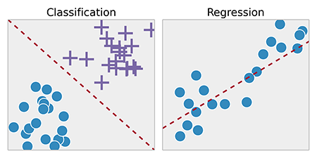

---

# Petit test

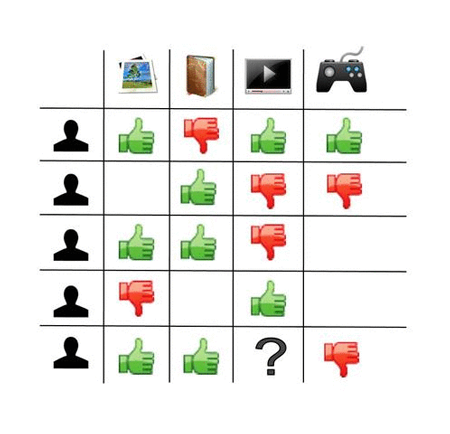

---

# Petit test

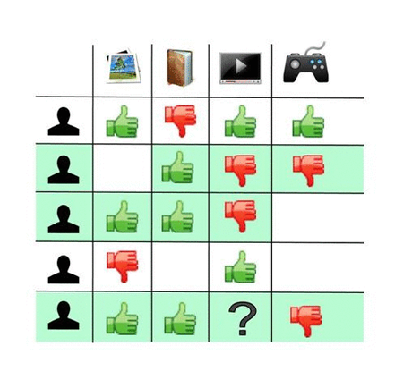

---

# Exemples

* Scoring client
* Rentabilité d'une campagne
* Affecter une catégorie à un produit
* Ségmenter les visiteurs d'un site
* ...

---

# Deep Learning

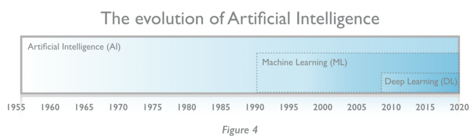

---

# Exemple - Base de données MNIST

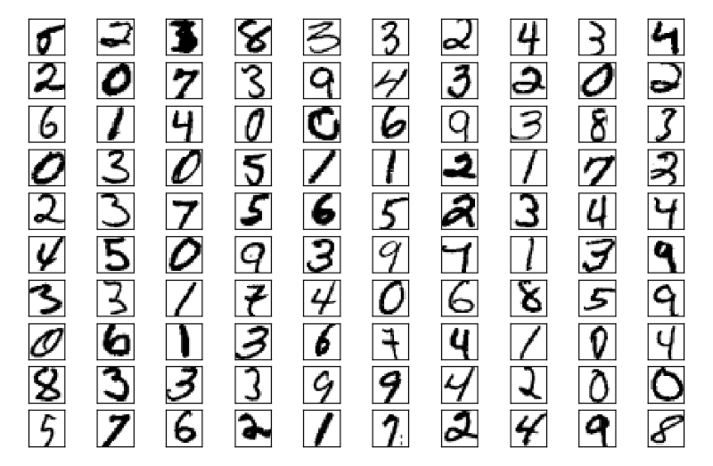

---

# Par pixel

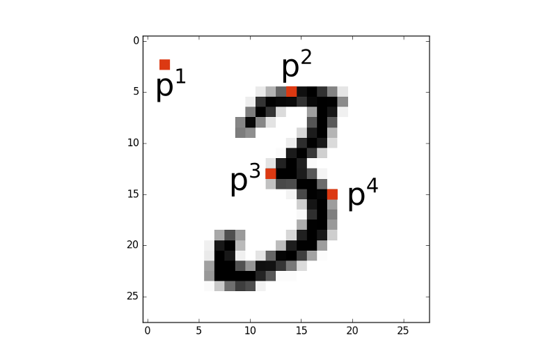

---

# Par groupe

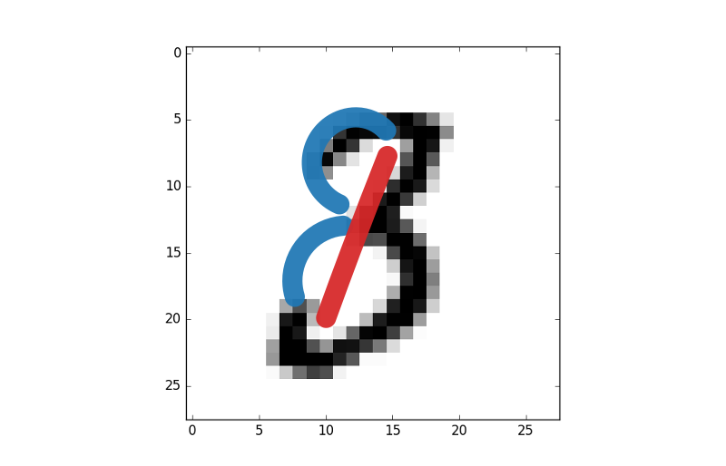

---

# Exemples d'usage

## Coloration d'images en N&B

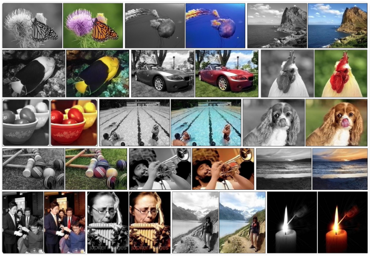

---

# Exemples d'usage

## Traduction automatique

---

# Exemples d'usage

## Reconnaissance d'objets

---

# Exemples d'usage

## Génération d'écriture manuscrite

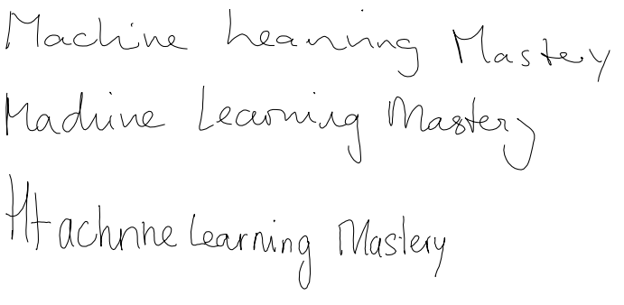

---

# Exemples d'usage

## Rédaction de textes

---

# D'autres exemples

[8 Inspirational Applications of Deep Learning](https://machinelearningmastery.com/inspirational-applications-deep-learning/)